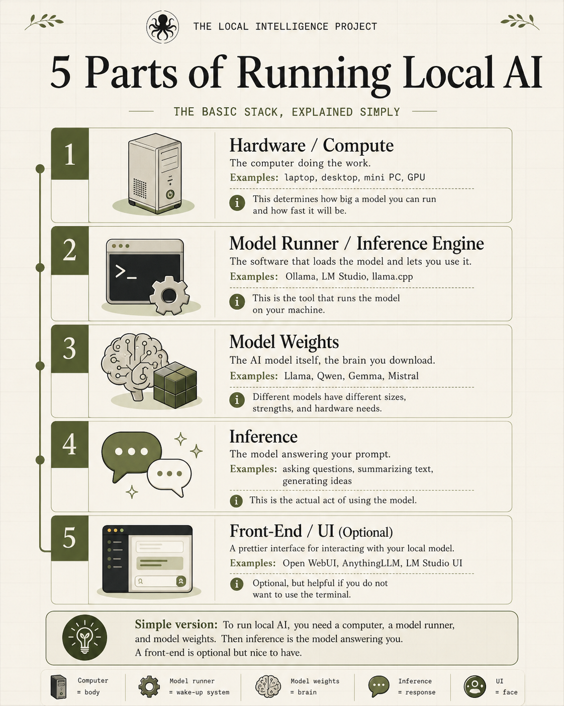
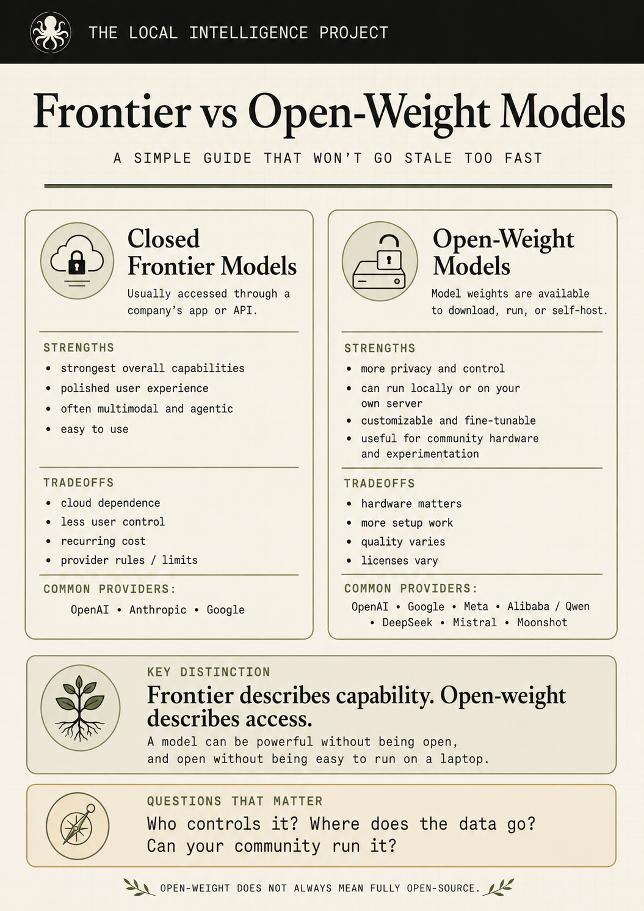

  

# TLIP Local AI Starter Pack

> Check your device. Pick a runner. Run your first local model. Add your own
> documents. Build slowly from there.

This is the working starter pack for The Local Intelligence Project. It is for
people who used the Tinbot Device Checker and want practical files they can
download, copy, test, improve, and bring to a branch, library, repair group, or
local AI workshop.

## Quick Links

| I want to... | Start here |
| --- | --- |
| Understand the whole flow | [00 - Start Here](docs/00-start-here.md) |
| Install a runner and run one model | [01 - First Local Model](docs/01-first-local-model.md) |
| Compare open-weight/local model families | [02 - Living Model Matrix](docs/02-model-matrix.md) |
| Add my own files or branch documents | Coming soon |
| Build an AI companion | Coming soon |
| Build a simple tool-using agent | Coming soon |
| Fine-tune responsibly | Coming soon |

## The First-Run Path

| Step | Action | Output |
| --- | --- | --- |
| 1 | Check your device specs | RAM, storage, OS, GPU/VRAM, likely role |
| 2 | Pick one runner | Ollama, LM Studio, or llama.cpp |
| 3 | Download one model | Start smaller than your machine can theoretically handle |
| 4 | Run local chat | Test speed, heat, quality, and memory pressure |
| 5 | Add documents | Use a knowledge pack/RAG before fine-tuning |
| 6 | Build slowly | Companion, agent, tools, memory, or fine-tune |

## Downloadable Templates

| Template | Use it for |
| --- | --- |
| [Device inventory](templates/device-inventory.md) | Logging a donated, rescued, or branch device |
| [Model test report](templates/model-test-report.md) | Recording what a model actually did on a real machine |
| [Knowledge-pack manifest](templates/knowledge-pack-manifest.yaml) | Tracking sources, permissions, and privacy notes for local documents |
| [Model matrix CSV](templates/model-matrix.csv) | Keeping a dated list of models, links, licenses, and hardware notes |

## Model And Runner Links

Runners: [Ollama](https://ollama.com/download),
[LM Studio](https://lmstudio.ai/docs/app/basics/download-model),
[llama.cpp](https://github.com/ggml-org/llama.cpp).

For model families, download links, and hardware tiers, see the
[Living Model Matrix](docs/02-model-matrix.md).

## Important Distinction

Open-weight does not always mean fully open-source. A model can make weights
available while still having license limits, missing training data, gated
access, or special terms. Always check the official model page and license
before recommending a model to someone else.

  

## Project Status

Status: draft starter pack.

The first stable milestone is:

- a dated model matrix,
- a beginner setup guide,
- a knowledge-pack template,
- a responsible fine-tuning checklist,
- and one community-endorsed how-to per topic.

## Contributing

Contributions should be practical and source-linked. See
[CONTRIBUTING.md](CONTRIBUTING.md).
